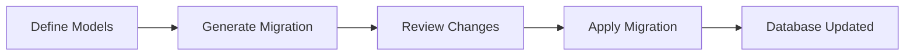

# Alembic Database Migrations Guide

## 🎯 What is Alembic?

Alembic is a **database migration tool** for SQLAlchemy. Think of it as **version control for your database schema** - just like Git tracks changes in your code, Alembic tracks changes in your database structure.

## 🤔 Why Do We Need Database Migrations?

### The Problem

Imagine you're developing the Eléva app:

1. **Week 1**: You create a `users` table with `email` and `password`
2. **Week 2**: You need to add a `username` field
3. **Week 3**: You need to add a `subjects` table
4. **Week 4**: You need to add a relationship between users and subjects

**Without migrations**, you would need to:
- Manually run SQL commands on each environment (dev, staging, production)
- Remember what changes were made and when
- Risk data loss or inconsistencies
- Have no way to rollback if something goes wrong

### The Solution

**Alembic automates this process** by:
- Generating migration scripts automatically
- Tracking which migrations have been applied
- Allowing rollbacks to previous states
- Ensuring all environments stay in sync

## 📁 Directory Structure

```
alembic/
├── versions/          # All migration files go here
│   ├── 001_initial_schema.py
│   ├── 002_add_username_to_users.py
│   └── 003_create_subjects_table.py
├── alembic.ini       # Configuration file
├── env.py            # Runtime configuration
└── script.py.mako    # Template for new migrations
```

## 🔄 How Alembic Works

### 1. **Tracking Database State**

Alembic creates a special table called `alembic_version` in your database that stores the current migration version:

```sql
SELECT * FROM alembic_version;
-- Result: current_revision = '003_create_subjects'
```

### 2. **Migration Files**

Each migration file contains:
- **Upgrade**: Instructions to apply changes
- **Downgrade**: Instructions to reverse changes

```python
# Example: 002_add_username_to_users.py
def upgrade():
    op.add_column('users', sa.Column('username', sa.String(100)))

def downgrade():
    op.drop_column('users', 'username')
```

### 3. **The Migration Flow**



## 🚀 Common Commands

### Initial Setup
```bash
# Initialize Alembic in your project
alembic init alembic

# Set your database URL in alembic.ini or env.py
```

### Creating Migrations

```bash
# Auto-generate migration from model changes
alembic revision --autogenerate -m "add username to users"

# Create empty migration for manual editing
alembic revision -m "custom migration"
```

### Applying Migrations

```bash
# Upgrade to latest version
alembic upgrade head

# Upgrade to specific version
alembic upgrade +2  # Forward 2 versions

# View current version
alembic current

# View migration history
alembic history
```

### Rolling Back

```bash
# Downgrade one version
alembic downgrade -1

# Downgrade to specific version
alembic downgrade 002

# Downgrade to beginning (careful!)
alembic downgrade base
```

## 🎬 Real-World Example: Eléva Project

### Scenario 1: Adding a New Field

You need to add `bio` field to the User model:

```python
# 1. Update your model
class User(Base):
    # ... existing fields ...
    bio = Column(Text)  # New field!

# 2. Generate migration
$ alembic revision --autogenerate -m "add bio to users"
# Creates: alembic/versions/004_add_bio_to_users.py

# 3. Review the generated file
def upgrade():
    op.add_column('users', sa.Column('bio', sa.Text(), nullable=True))

def downgrade():
    op.drop_column('users', 'bio')

# 4. Apply migration
$ alembic upgrade head
# Database now has the bio column!
```

### Scenario 2: Creating a New Table

You need to add the `documents` table:

```python
# 1. Create new model
class Document(Base):
    __tablename__ = "documents"
    id = Column(Integer, primary_key=True)
    title = Column(String(200))
    subject_id = Column(Integer, ForeignKey("subjects.id"))

# 2. Generate migration
$ alembic revision --autogenerate -m "create documents table"

# 3. Apply
$ alembic upgrade head
```

## ⚠️ Important Concepts

### Auto-generation Limitations

Alembic can auto-detect:
- ✅ Table additions/removals
- ✅ Column additions/removals
- ✅ Column type changes
- ✅ Index/constraint changes

Alembic CANNOT auto-detect:
- ❌ Table/column renames (sees as drop + add)
- ❌ Data migrations
- ❌ Custom SQL functions/triggers

### Best Practices

1. **Always review auto-generated migrations** - They might not be perfect
2. **Test migrations locally first** - Use a development database
3. **Back up production data** - Before running migrations
4. **Keep migrations small** - One logical change per migration
5. **Never edit applied migrations** - Create new ones to fix issues

## 🔥 Common Pitfalls & Solutions

### Problem 1: "Target database is not up to date"
```bash
# Solution: Apply pending migrations
alembic upgrade head
```

### Problem 2: "Can't locate revision identified by..."
```bash
# Solution: Check current version and history
alembic current
alembic history
```

### Problem 3: Migration fails in production
```bash
# Solution: Test the rollback locally first
alembic downgrade -1  # Rollback
# Fix the issue, create new migration
```

## 🎯 Alembic in CI/CD Pipeline

```yaml
# Example GitHub Actions workflow
deploy:
  steps:
    - name: Run migrations
      run: |
        alembic upgrade head
    - name: Deploy application
      run: |
        # ... deploy code
```

## 📊 Alembic vs Manual SQL

| Aspect | Manual SQL | Alembic |
|--------|------------|---------|
| Version tracking | ❌ Manual notes | ✅ Automatic |
| Rollback | ❌ Write reverse SQL | ✅ Built-in |
| Team sync | ❌ Share SQL files | ✅ Git + migrations |
| Environment sync | ❌ Run on each | ✅ Single command |
| Change history | ❌ Lost | ✅ Preserved |

## 🚦 Migration Workflow in Development

```bash
# 1. Make model changes
# Edit app/models/user.py

# 2. Generate migration
alembic revision --autogenerate -m "describe changes"

# 3. Review generated file
# Check alembic/versions/xxx_describe_changes.py

# 4. Test migration
alembic upgrade head  # Apply
alembic downgrade -1  # Test rollback
alembic upgrade head  # Re-apply

# 5. Commit both model and migration
git add app/models/user.py alembic/versions/xxx_describe_changes.py
git commit -m "Add new field to User model"

# 6. Other developers pull and run
git pull
alembic upgrade head  # Their DB is now in sync!
```

## 💡 Key Takeaway

**Alembic is essential for production applications** because it:
- Keeps all environments (dev, staging, prod) in sync
- Provides safe rollback mechanisms
- Documents all database changes
- Enables team collaboration
- Prevents manual errors

Think of it this way: **You wouldn't deploy code without version control (Git), so why deploy database changes without migration control (Alembic)?**

---

*Remember: Migrations are as important as your code. Always test them thoroughly before applying to production!*